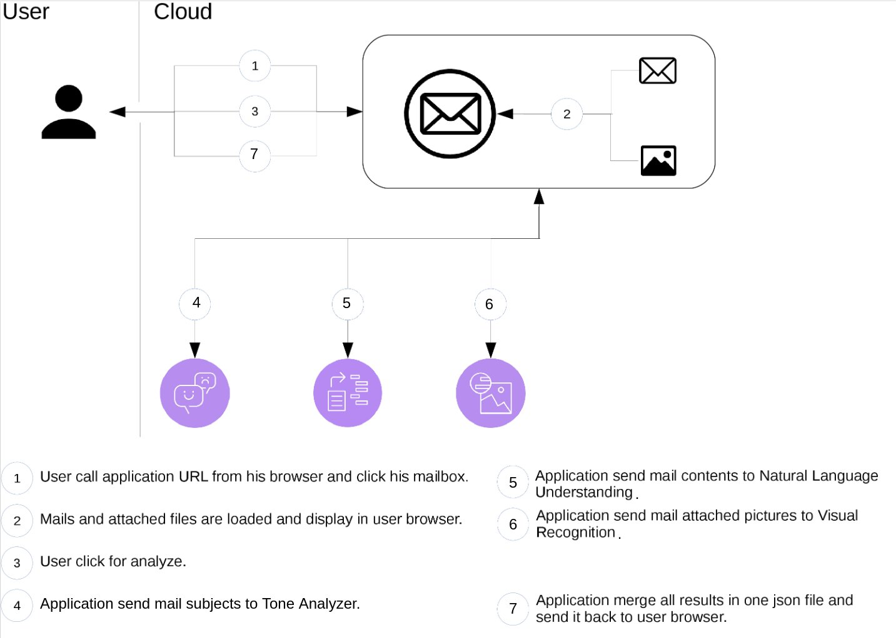
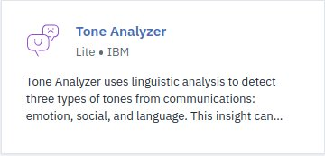
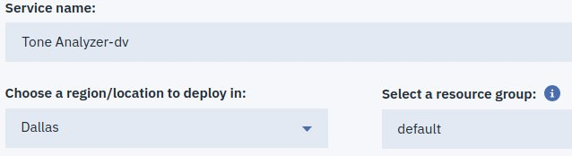
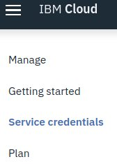
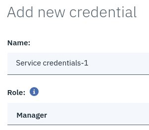
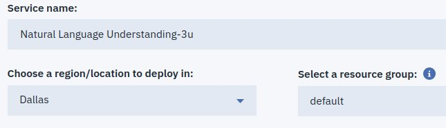
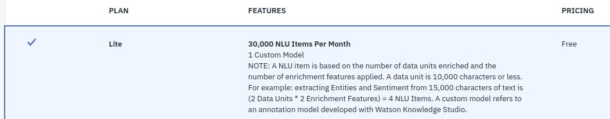
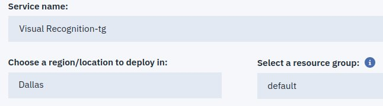
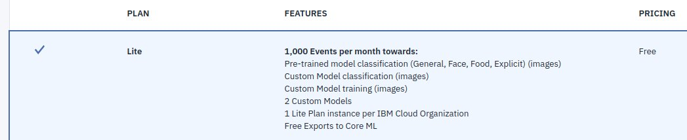

# Mailbox Analyzer

MailBox Analyzer is an application using [Watson Developer Cloud Java SDK](https://github.com/watson-developer-cloud/java-sdk) to demonstrate how to use the [Watson Developer Cloud services](https://www.ibm.com/watson/products-services/), a collection of REST APIs and SDKs that use cognitive computing to solve complex problems.

<br>

## Table of Contents

<!--
- [Overview of the application](#overview-of-the-application)
-->
- [Application Flow](#application-flow)
- [Prerequisite](#prerequisite)
  * [Install needed softwares](#install-needed-softwares)
  * [Check everything is installed properly](#check-everything-is-installed-properly)
  * [Check your IBM Cloud account](#check-your-ibm-cloud-account)
  * [Add some environment variables and aliases](#add-some-environment-variables-and-aliases)
- [Login to IBM Cloud](#login-to-ibm-cloud)
- [Setup environment with IBM Cloud Graphical User Interface](#setup-environment-with-ibm-cloud-graphical-user-interface)
- [Setup environment with command line](#setup-environment-with-command-line)
  * [Dump marketplace to get service name plan and description](#dump-marketplace-to-get-service-name-plan-and-description)
  * [Setup Tone Analyzer service](#setup-tone-analyzer-service)
    + [Get name and plan for Tone Analyzer service](#get-name-and-plan-for-tone-analyzer-service)
    + [Create Tone Analyzer service](#create-tone-analyzer-service)
    + [Create service key for Tone Analyzer service](#create-service-key-for-tone-analyzer-service)
  * [Setup Natural Language Understanding service](#setup-natural-language-understanding-service)
    + [Get name and plan for Natural Language Understanding service](#get-name-and-plan-for-natural-language-understanding-service)
    + [Create Natural Language Understanding service](#create-natural-language-understanding-service)
    + [Create service key for Natural Language Understanding service](#create-service-key-for-natural-language-understanding-service)
  * [Setup Discovery service](#setup-discovery-service)
    + [Get name and plan for Discovery service](#get-name-and-plan-for-discovery-service)
    + [Create Discovery service](#create-discovery-service)
    + [Create service key for Discovery service](#create-service-key-for-discovery-service)
  * [Create Discovery Collection](#create-discovery-collection)
      + [Store Discovery collection name in DSC_COLL_NAME environment variable](#store-discovery-collection-name-in-dsc_coll_name-environment-variable)
    + [Store Discovery collection language in DSC_COLL_LANG environment variable](#store-discovery-collection-language-in-dsc_coll_lang-environment-variable)
    + [Store Discovery version in DSC_VERSION environment variable](#store-discovery-version-in-dsc_version-environment-variable)
    + [Create collection coll0](#create-collection-coll0)
  * [Create Visual Recognition service](#create-visual-recognition-service)
    + [Get name and plan for Visual Recognition service](#get-name-and-plan-for-visual-recognition-service)
    + [Create Visual Recognition service](#create-visual-recognition-service)
    + [Create service key for Visual Recognition service](#create-service-key-for-visual-recognition-service)
  * [Check environment is setup correctly](#check-environment-is-setup-correctly)
- [Setup application](#setup-application)
  * [Get application code](#get-application-code)
  * [Prepare for application deployment](#prepare-for-application-deployment)
- [Deploy application](#deploy-application)
- [Run application](#run-application)
- [Send your own datas for analysis](#send-your-own-datas-for-analysis)
- [Clean your room](#clean-your-room)
- [About Watson Developer Cloud services being used in the application](#about-watson-developer-cloud-services-being-used-in-the-application)
- [About other Watson Developer Cloud services](#about-other-watson-developer-cloud-services)

<br>

<!--
### Overview of the application

A sample demo of the application with a mailbox analysis *may be* available [here](http://ma.bpshparis.eu-de.mybluemix.net).

<br>
-->

### Application Flow


<br>

### Prerequisite

<br>

#### Install needed softwares

> :bulb: Ctrl + Click on links below to open them in new tab and keep the tutorial tab opened.


* Download and install [IBM Cloud CLI](https://console.bluemix.net/docs/cli/reference/ibmcloud/download_cli.html)  
* Download and install [curl](https://curl.haxx.se/windows/)
* Download [jq](https://github.com/stedolan/jq/releases/download/jq-1.5/jq-win64.exe), rename it to **jq** and copy it in your %PATH%.


* Download and install [IBM Cloud CLI](https://console.bluemix.net/docs/cli/reference/ibmcloud/download_cli.html)  
* **curl** should already be installed. If not, get it from [here](https://curl.haxx.se/dlwiz/?type=bin&os=Mac+OS+X&flav=-&ver=-&cpu=i386)
* Download [jq](https://github.com/stedolan/jq/releases/download/jq-1.5/jq-osx-amd64), rename it to **jq**, :warning: set its attribute to executable (e.g. **chmod +x**) and copy it in your $PATH.


* Download and install [IBM Cloud CLI](https://console.bluemix.net/docs/cli/reference/ibmcloud/download_cli.html)  
* Get **curl** from your distribution repository or download and install it from [here](https://curl.haxx.se/dlwiz/?type=bin&os=Linux).
* Get **jq** from your distribution repository or download it from [here](https://github.com/stedolan/jq/releases/download/jq-1.5/jq-linux64), rename it to **jq**, :warning: set its attribute to executable (e.g. **chmod +x**) and copy it in your $PATH.
* Download a [JDK](https://www.oracle.com/technetwork/java/javase/downloads/index.html) and install it.
* Download [WAS Liberty Kernel](https://developer.ibm.com/wasdev/downloads/#asset/runtimes-wlp-kernel).
<br>

#### Check everything is installed properly

  

   

Check ibmcloud command is available:

	ibmcloud -v

Check curl command is available:

	curl -V

Check jq command is available:

	jq

<br>

### Login to IBM Cloud

:bulb: To avoid being prompt when using ibmcloud command set the following config parameters

	ibmcloud config --check-version false
	ibmcloud config --usage-stats-collect false

Let's connect to :de:

   

	iclde	
	
 

	%iclde%	

> :no_entry: If **login failed** because of logging in with a federated ID, then browse one of the following url:

> :bulb: Ctrl + Click on links below to open them in new tab and keep the tutorial tab opened.

 * https://login.ng.bluemix.net/UAALoginServerWAR/passcode
 * https://login.eu-gb.bluemix.net/UAALoginServerWAR/passcode
 * https://login.eu-de.bluemix.net/UAALoginServerWAR/passcode
 
> and get a one-time passcode.

> Then login with **--sso**,

   

	iclsso
	
 

	%iclsso%	
	
> paste the one-time passcode when prompt

	One Time Code (Get one at https://login.eu-gb.bluemix.net/UAALoginServerWAR/passcode)>
	
> and hit enter.

> Then create an API key called apikey0 and save it in apikey0 file in current directory
	
	ibmcloud iam api-key-create apikey0 -d "apikey0" --file apikey0

> Now login with your API key stored in apikey0 file in current directory

	ibmcloud login target --apikey @apikey0
	
> and target :de: endpoint

   

	ibmcloud target --cf-api ${DE_ENDPOINT} -o $ORG -s $SPACE
	
 	

	ibmcloud target --cf-api %DE_ENDPOINT% -o %ORG% -s %SPACE%

:thumbsup: Now you should be logged and ready to setup environment.

<br>

<!--
Select a region (or press enter to skip):
1. au-syd
2. jp-tok
3. eu-de
4. eu-gb
5. us-south
6. us-east
Enter a number> 
-->

### Setup environment with IBM Cloud Graphical User Interface


Ctrl + Click on [IBM Cloud Catalog](https://console.bluemix.net/catalog/?category=ai)

To instanciate **Tone Analyzer** service click



Wait for followings panels to be available:




Then hit 


:zzz: When you land on,


:thumbsup: this mean that the **Tone Analyzer** service as been successfully instantiate.

<!--
To be ready to use  **Tone Analyzer** instance need a new credential to be created. So click on **Service credentials** available on top left under the menu:



Then click


Keep default setting



and hit 


-->

To instanciate **Natural Language Understanding** service, go back to [IBM Cloud Catalog](https://console.bluemix.net/catalog/?category=ai) and click


Wait for followings panels to be available:





Then hit 


:zzz: When you land on,


:thumbsup: this mean that the **Natural Language Understanding** service as been successfully instantiate.

To instanciate **Visual Recognition** service, go back to [IBM Cloud Catalog](https://console.bluemix.net/catalog/?category=ai) and click


Wait for followings panels to be available:





Then hit 


:zzz: When you land on,


:thumbsup: this mean that the **Visual Recognition** service as been successfully instantiate.

> :checkered_flag: You are done with environment setup. Now at least three Watson services should be created.
You can check it in your [IBM Cloud Dashboard](https://console.bluemix.net/dashboard/apps).

### Setup environment with command line

#### Dump marketplace to get service name, plan and description

:zzz: It may take a minute to display 

   

	ibmcloud service offerings | tee marketplace

 	

	ibmcloud service offerings > marketplace

<br>

#### Setup Tone Analyzer service

 **Tone Analyzer** uses linguistic analysis to detect three types of tones from communications: emotion, social, and language.  This insight can then be used to drive high impact communications.

##### Get name and plan for Tone Analyzer service

<!--
	ibmcloud catalog search tone
	ibmcloud catalog service tone-analyzer
	ibmcloud resource service-instance-create ta tone-analyzer lite eu-de
	ibmcloud resource service-key-create taKey Manager --instance-name ta
	export TA_APIKEY=$(ibmcloud resource service-key taKey | awk '/^\s*apikey:/ {print $2}') && echo $TA_APIKEY
	export TA_URL=$(ibmcloud resource service-key taKey | awk '/^\s*url:/ {print $2}') && echo $TA_URL
	export TA_METHOD=/v3/tone?version=2017-09-21 && echo $TA_METHOD
	export TA_TEXT="On en a gros !" && echo $TA_TEXT
	jq -n --arg value "$TA_TEXT" '{"text": $value}' | tee ta.req.json | jq .
	curl -X POST -u 'apikey:'$TA_APIKEY -H 'Content-Type: application/json' -H 'Content-Language: fr' -H 'Accept-Language: fr' -d @ta0.req.json $TA_URL$TA_METHOD | tee ta.resp.json | jq .
-->

   

	grep -i tone marketplace
	
 

	find /I "tone" marketplace

##### Create Tone Analyzer service
	ibmcloud service create tone_analyzer lite ta0

##### Create service key for Tone Analyzer service
	ibmcloud service key-create ta0 user0

<br>

#### Setup Natural Language Understanding

 **Natural Language Understanding** analyze text to extract meta-data from content such as concepts, entities, emotion, relations, sentiment and more.

##### Get name and plan for Natural Language Understanding service

<!--
	ibmcloud catalog search understanding
	ibmcloud catalog service natural-language-understanding
	ibmcloud resource service-instance-create nlu natural-language-understanding free eu-de	
	ibmcloud resource service-key-create nluKey Manager --instance-name nlu
	export NLU_APIKEY=$(ibmcloud resource service-key nluKey | awk '/^\s*apikey:/ {print $2}') && echo $NLU_APIKEY
	export NLU_URL=$(ibmcloud resource service-key nluKey | awk '/^\s*url:/ {print $2}') && echo $NLU_URL
	export NLU_METHOD=/v1/analyze?version=2018-11-16 && echo $NLU_METHOD
	export NLU_FEATURES='{"sentiment": {}, "keywords": {}, "entities": {}}' && echo "$NLU_FEATURES" | jq .
	export NLU_TEXT="J'aimerai avoir des nouvelles de ma commande passée il y a déjà 15 jours et que je n'ai toujours pas reçu." && echo $NLU_TEXT
	jq -n --argjson features "$NLU_FEATURES" --arg text "$NLU_TEXT" '{"text": $text, "features": $features}' | tee nlu.req.json | jq .
	curl -X POST -u 'apikey:'$NLU_APIKEY -H 'Content-Type: application/json' -d @nlu.req.json $NLU_URL$NLU_METHOD | tee nlu.resp.json | jq .
-->


   

	grep -i language marketplace

 

	find /I "language" marketplace

##### Create Natural Language Understanding service
	ibmcloud service create natural-language-understanding free nlu0

##### Create service key for Natural Language Understanding service
	ibmcloud service key-create nlu0 user0

<br>

#### Create Visual Recognition service

 **Visual Recognition** find meaning in visual content! Analyze images for scenes, objects, faces, and other content. Choose a default model off the shelf, or create your own custom classifier. Develop smart applications that analyze the visual content of images or video frames to understand what is happening in a scene.

##### Get name and plan for Visual Recognition service

<!--
	ibmcloud catalog search vision
	ibmcloud catalog service watson-vision-combined
	ibmcloud resource service-instance-create wvc watson-vision-combined lite us-south	
	ibmcloud resource service-key-create wvcKey Manager --instance-name wvc
	export WVC_APIKEY=$(ibmcloud resource service-key wvcKey | awk '/^\s*apikey:/ {print $2}') && echo $WVC_APIKEY
	export WVC_URL=$(ibmcloud resource service-key wvcKey | awk '/^\s*url:/ {print $2}') && echo $WVC_URL
	export WVC_METHOD=/v3/classify?version=2018-03-19 && echo $WVC_METHOD
	export IMG=$(readlink -f image1.jpg) && echo $IMG
	curl -X POST -u 'apikey:'$WVC_APIKEY -H 'Accept-Language: fr' -F 'images_file=@'$IMG $WVC_URL$WVC_METHOD | tee wvc.resp.json | jq .
-->

  

	grep -i visual marketplace
	
 

	find /I "visual" marketplace
	

##### Create Visual Recognition service

	ibmcloud resource service-instance-create wvc0 watson-vision-combined lite us-south	
	
	ibmcloud  resource service-alias-create wvc0 --instance-name wvc0

##### Create service key for Visual Recognition service

	ibmcloud service key-create wvc0 user0

<br>

#### Check environment is setup correctly

> :checkered_flag: You are done with environment setup. Now at least four Watson services should be created (**ta, nlu, and wvc**) in your space.

>Check it with

	ibmcloud resource service-instances

<br>
	
### Setup application

#### Get application code

Download code

	curl -LO  https://github.com/bpshparis/cp2019/archive/master.zip

and unzip it:

	unzip master.zip

#### Install WAS Liberty Kernel

	unzip wlp-kernel-19.0.0.2.zip
	
Create defaultServer

	wlp/bin/server create
	
Replace **wlp/usr/servers/defaultServer/server.xml** with this section
```
<?xml version="1.0" encoding="UTF-8"?>
<server description="new server">

    <!-- Enable features -->
        <featureManager>
            <feature>servlet-3.0</feature>
        </featureManager>

        <httpEndpoint host="*" httpPort="9080" httpsPort="9443" id="defaultHttpEndpoint"/>
        <application id="app" location="app.war" name="app"/>

</server>
```
then run

	wlp/bin/installUtility install defaultServer

to configure defaultServer.
	
#### Add application to defaultServer

Create **wlp/usr/servers/defaultServer/apps/dma.war.xml** with the following content:
```
<?xml version="1.0" encoding="UTF-8"?>
<archive>
    <dir sourceOnDisk="${APP_CODE_PATH}/WebContent" targetInArchive="/"/>
</archive>
```
:warning: Substitute ${APP_CODE_PATH} with the full path where you unzip application code earlier. 

#### Set environment to access Watson service instances in IBM Cloud

Change to code directory

	cd CP2019-master

> Now if you stand in the correct directory, you should be able to list files such as **resources.sh** and **resourcesAG.sh**.


#### Run application

start WAS Liberty Kernel defaultServer

	wlp//bin/server start defaultServer


Then browse [app](http://localhost:9080/app)

When app is loaded, click on  to upload sample attached documents in Discovery Collection and get sample mails.

Once mails are displayed, click  to send sample mails for analysis.

When Watson returned, **3 new tabs** (one per service) should appear and are ready to browse. 


<br>

### Send your own datas for analysis


Edit a json file of this form :

```
[
  {
    "subject": "paste some text between double quotation marks or set to null",
    "content": "paste some text between double quotation marks or set to null",
    "attached": "paste a doc|docx|pdf file name between double quotation marks or set to null",
    "picture": "paste a picture file name between double quotation marks or set to null",
    "face": "paste a picture file name between double quotation marks or set to null",
    "tip": "paste a picture file name between double quotation marks or set to null"
  }
]
```

An example for 2 mails with documents and pictures attached :

```
[
  {
      "subject": "At UEFA, Mounting Concern About A.C. Milan’s Murky Finances",
      "content": null,
      "attached": "3.pdf",
      "picture": "pic3.jpg",
      "face": null,
      "tip": null
  },
  {
      "subject": null,
      "content": "At a flea market six years ago, a North Carolina lawyer named Frank Abrams unknowingly bought...",
      "attached": "4.doc",
      "picture": null,
      "face": "face4.jpg",
      "tip": "tip4.jpg"
  }
]
```

Save this file as **mails.json** 

:bulb: Test it with jq

	jq . mails.json

The command should display pretty json without error.

Now **zip mails.json with all files set in attached, picture, face and tip fields from mails.json**.

:bulb: your archive should be this form

```
Archive:  mails0.zip
    testing: 3.doc                    OK
    testing: 3.pdf                    OK
    testing: 4.doc                    OK
    testing: face4.jpg                OK
    testing: mails.json               OK
    testing: pic3.jpg                 OK
    testing: tip4.jpg                 OK
No errors detected in compressed data of mails0.zip.
```
Now go back to your application and click  to upload your datas.

Once your datas have been upload, click on  to upload your attached documents in Discovery Collection and get your mails.

Once your mails are displayed, click  to send your mails for analysis.

<br>

### Clean your room

  

	export APP_NAME=app0 && for svc in ta0 nlu0 dsc0 wvc0; do ibmcloud service unbind ${APP_NAME} $svc; ibmcloud service key-delete -f $svc user0; ibmcloud service delete -f $svc; done && ic app delete ${APP_NAME} -f

 

Browse your [IBM Cloud dashboard](https://console.bluemix.net/dashboard/apps)

Open each services **More Actions** popup menu and choose **Delete Service**


Do the same for application. Open application **More Actions** popup menu and choose **Delete App**


<br>

### About Watson Developer Cloud services being used in the application

 **Tone Analyzer** uses linguistic analysis to detect three types of tones from communications: emotion, social, and language.  This insight can then be used to drive high impact communications.

[Documentation](https://console.bluemix.net/docs/services/tone-analyzer/getting-started.html) 
[Dashboard](https://www.ibm.com/watson/developercloud/dashboard/en/tone-analyzer-dashboard.html) 
[Github](https://github.com/watson-developer-cloud)

 **Natural Language Understanding** analyze text to extract meta-data from content such as concepts, entities, emotion, relations, sentiment and more.

[Documentation](https://console.bluemix.net/docs/services/natural-language-understanding/getting-started.html)
[Dashboard](https://www.ibm.com/watson/developercloud/dashboard/en/natural-language-understanding-dashboard.html)
[Github](https://github.com/watson-developer-cloud)

 **Discovery** add a cognitive search and content analytics engine to applications.

[Documentation](https://console.bluemix.net/docs/services/discovery/getting-started.html)
[Dashboard](https://www.ibm.com/watson/developercloud/dashboard/en/discovery-dashboard.html)
[Github](https://github.com/watson-developer-cloud)
[Tool](https://watson-discovery.bluemix.net)

 **Visual Recognition** find meaning in visual content! Analyze images for scenes, objects, faces, and other content. Choose a default model off the shelf, or create your own custom classifier. Develop smart applications that analyze the visual content of images or video frames to understand what is happening in a scene.

[Documentation](https://console.bluemix.net/docs/services/visual-recognition/getting-started.html)
[Dashboard](https://www.ibm.com/smarterplanet/us/en/ibmwatson/developercloud/dashboard/en/visual-recognition-dashboard.html)
[Github](https://github.com/watson-developer-cloud)
[Tool](https://watson-visual-recognition.ng.bluemix.net/)

<br>

### About other Watson Developer Cloud services

 **Speech to Text** Low-latency, streaming transcription.

[Documentation](https://console.bluemix.net/docs/services/speech-to-text/getting-started.html)
[Dashboard](https://www.ibm.com/watson/developercloud/dashboard/en/speech-to-text-dashboard.html)
[Github](https://github.com/watson-developer-cloud)

 **Text to Speech** Synthesizes natural-sounding speech from text.

[Documentation](https://console.bluemix.net/docs/services/text-to-speech/getting-started.html)
[Dashboard](https://www.ibm.com/watson/developercloud/dashboard/en/text-to-speech-dashboard.html)
[Github](https://github.com/watson-developer-cloud)

 **Language Translator** Translate text from one language to another for specific domains.

[Documentation](https://console.bluemix.net/docs/services/language-translator/getting-started.html)
[Dashboard](https://www.ibm.com/watson/developercloud/dashboard/en/language-translator-dashboard.html)
[Github](https://github.com/watson-developer-cloud)

 **Personality Insights** The Watson Personality Insights derives insights from transactional and social media data to identify psychological traits

[Documentation](https://console.bluemix.net/docs/services/personality-insights/getting-started.html)
[Dashboard](https://www.ibm.com/watson/developercloud/dashboard/en/personality-insights-dashboard.html)
[Github](https://github.com/watson-developer-cloud)

 **Conversation** Add a natural language interface to your application to automate interactions with your end users. Common applications include virtual agents and chat bots that can integrate and communicate on any channel or device. 

[Documentation](https://console.bluemix.net/docs/services/conversation/getting-started.html)
[Dashboard](https://www.ibm.com/watson/developercloud/dashboard/en/conversation-dashboard.html)
[Github](https://github.com/watson-developer-cloud)
[Tool](https://watson-conversation.ng.bluemix.net)

 **Natural Language Classifier** performs natural language classification on question texts. A user would be able to train their data and the predict the appropriate class for a input question.

[Documentation](https://console.bluemix.net/docs/services/natural-language-classifier/getting-started.html)
[Dashboard](https://www.ibm.com/watson/developercloud/dashboard/en/natural-language-classifier-dashboard.html)
[Github](https://github.com/watson-developer-cloud)
[Tool](https://natural-language-classifier-toolkit.eu-gb.bluemix.net)

### Annexes

#### Run application elsewhere from IBM Cloud

##### Using Resource Group (Manual-generated service credentials)

```
#!/bin/sh

output=resources.json

echo '{}' | tee $output

services=$(ibmcloud service list | awk 'NR>6 {print "{\""$2"\":[{\"credentials\":null,\"name\":\""$1"\"}]}"}')

count=$(ibmcloud resource service-instances | awk -F'   ' 'NR>3 {count++} END {print count}') && echo $count " service-instances found."

instances=$(ibmcloud resource service-instances | awk -F'   ' 'NR>3 {print $1 ";;"}')

for i in $(seq 1 $count)
	do
		instance=$(echo $instances | awk -F ';;' '{print $'$i'  }');
		# service=$(echo $service | tr -d '[:space:]');
		instance=$(echo $instance | sed -e 's/^[[:space:]]*//');
		echo "Getting setting for service-instance "$instance;
		obj=$(ibmcloud resource service-instance "$instance" | awk -F ':' '/^ID:/ {print $6 ":" $7 ":" $9}');
		# echo $obj;

		service=$(echo $obj | cut -d':' -f1);
		region=$(echo $obj | cut -d':' -f2);
		id=$(echo $obj | cut -d':' -f3);

		region=$(ibmcloud resource service-instance "$instance" | awk -F ':' '/^ID:/ {print $7}');
		jq --argjson svc "{\"$id\":{\"credentials\":null,\"service\":\"$service\",\"region\":\"$region\",\"instance\":\"$instance\"}}" '. += $svc' $output | sponge $output;


	done

count=$(ibmcloud resource service-keys | awk -F'   ' 'NR>3 {count++} END {print count}') && echo $count " service-keys found."
keys=$(ibmcloud resource service-keys | awk -F'   ' 'NR>3 {print $1 ";;"}')

for i in $(seq 1 $count)
	do
		keyName=$(echo $keys | awk -F ';;' '{print $'$i'  }');
		# service=$(echo $service | tr -d '[:space:]');
		keyName=$(echo $keyName | sed -e 's/^[[:space:]]*//');
		echo "Getting setting for service-key "$keyName;
		obj=$(ibmcloud resource service-key "$keyName" | awk -F ':' '/^ID:/ {print $9 ":" $11}');
		instanceId=$(echo $obj | cut -d':' -f1);
		keyId=$(echo $obj | cut -d':' -f2);
		apikey=$(ibmcloud resource service-key "$keyName" | awk -F ':' '/^\s*apikey:/ {print $2}');
		apikey=$(echo $apikey | tr -d '[:space:]');
		url=$(ibmcloud resource service-key "$keyName" | awk '/^\s*url:/ {print $2}');
		role=$(ibmcloud resource service-key "$keyName" | awk -F ':' '/^\s*iam_role_crn:/ {print $11}');
		role=$(echo $role | tr -d '[:space:]');

		cred='{"id": "'$keyId'", "name": "'$keyName'", "apikey": "'$apikey'", "url": "'$url'", "role": "'$role'"}';

		jq --argjson cred "$cred" 'if (.["'$instanceId'"]) then .["'$instanceId'"].credentials[.["'$instanceId'"].credentials| length] |= . + $cred else . end' $output | sponge $output;

	done

jq . $output

echo ""
echo "!!!! Resources available in " $(readlink -f $output) " !!!!"

# Sample usage:
# jq -r '.[] | select(.instance=="Visual Recognition-cv" and .credentials[1].role=="Writer") | .credentials[1].apikey + ":" + .credentials[1].role' $output


exit 0;
``` 

##### Using Resource Group (Auto-generated service credentials)

```
#!/bin/bash

input=credentials
output=resourcesAG.json

echo '{}' | tee $output

services=$(ibmcloud service list | awk 'NR>6 {print "{\""$2"\":[{\"credentials\":null,\"name\":\""$1"\"}]}"}')

count=$(ibmcloud resource service-instances | awk -F'   ' 'NR>3 {count++} END {print count}') && echo $count " service-instances found."

instances=$(ibmcloud resource service-instances | awk -F'   ' 'NR>3 {print $1 ";;"}')

for i in $(seq 1 $count)
	do
		instance=$(echo $instances | awk -F ';;' '{print $'$i'  }');
		# service=$(echo $service | tr -d '[:space:]');
		instance=$(echo $instance | sed -e 's/^[[:space:]]*//');
		echo "Getting setting for service-instance "$instance;
		obj=$(ibmcloud resource service-instance "$instance" | awk -F ':' '/^ID:/ {print $6 ":" $7 ":" $9}');
		# echo $obj;

		service=$(echo $obj | cut -d':' -f1);
		region=$(echo $obj | cut -d':' -f2);
		id=$(echo $obj | cut -d':' -f3);

		region=$(ibmcloud resource service-instance "$instance" | awk -F ':' '/^ID:/ {print $7}');
		jq --argjson svc "{\"$id\":{\"credentials\":null,\"service\":\"$service\",\"region\":\"$region\",\"instance\":\"$instance\"}}" '. += $svc' $output | sponge $output;


	done

ibmcloud resource service-key "Auto-generated service credentials" > ./input;

instanceIds=();
keyIds=();
keyNames=();
apikeys=();
urls=();
roles=();

while read LINE
  do
    id=$(echo $LINE | awk -F ':' '/^ID:/ {print $9 ":" $11}');
    instanceId=$(echo $id | cut -d':' -f1);
    if [ ! -z "$instanceId" ]; then
      instanceIds+=($instanceId);
    fi

    keyId=$(echo $id | cut -d':' -f2);
    if [ ! -z "$keyId" ]; then
      keyIds+=($keyId);
    fi

    keyName=$(echo $LINE | awk -F ':' '/^Name:/ {print $2}');
    keyName=$(echo $keyName | sed -e 's/^[[:space:]]*//');
    if [ ! -z "$keyName" ]; then
      keyNames+=("$keyName")
    fi

    apikey=$(echo $LINE | awk -F ':' '/^\s*apikey:/ {print $2}');
		apikey=$(echo $apikey | tr -d '[:space:]');
    if [ ! -z "$apikey" ]; then
      apikeys+=($apikey)
    fi

    url=$(echo $LINE | awk '/^\s*url:/ {print $2}');
    if [ ! -z "$url" ]; then
      urls+=($url)
    fi

    role=$(echo $LINE | awk -F ':' '/^\s*iam_role_crn:/ {print $11}');
    role=$(echo $role | tr -d '[:space:]');
    if [ ! -z "$role" ]; then
      roles+=($role)
    fi

  done < ./input

rm -f ./input;

echo "instanceIds="${instanceIds[@]};
echo "keyNames="${keyNames[@]};
echo "keyIds="${keyIds[@]};
echo "apikeys="${apikeys[@]};
echo "urls="${urls[@]};
echo "roles="${roles[@]};

count=${#apikeys[@]};
echo $count "service-keys found";

for i in $(seq 0 $(($count -1)))
  do
    echo "Getting setting for service-key "${keyNames[$i]};
    cred='{"id": "'${keyIds[$i]}'", "name": "'${keyNames[$i]}'", "apikey": "'${apikeys[$i]}'", "url": "'${urls[$i]}'", "role": "'${roles[$i]}'"}';
    echo $cred;
    jq --argjson cred "$cred" 'if (.["'${instanceIds[$i]}'"]) then .["'${instanceIds[$i]}'"].credentials[.["'${instanceIds[$i]}'"].credentials| length] |= . + $cred else . end' $output | sponge $output;
  done

jq . $output

echo ""
echo "!!!! Resources available in " $(readlink -f $output) " !!!!"

# Sample usage:
# jq -r '.[] | select(.instance=="Visual Recognition-cv" and .credentials[1].role=="Writer") | .credentials[1].apikey + ":" + .credentials[1].role' $output


exit 0;
```

##### Using Cloud Foundry

```
#!/bin/sh

output=vcap.json

echo '{}' | tee $output

services=$(ibmcloud service list | awk 'NR>6 {print "{\""$2"\":[{\"credentials\":null,\"name\":\""$1"\"}]}"}')

for service in $(echo $services)
	do 
		jq --argjson value $service '. += $value' $output | sponge $output; 
	done

for svc in $(ibmcloud service list | awk 'NR>6 {print $1 ":" $2}')
	do
		echo $svc;
		label=$(echo $svc | cut -d':' -f2);
		name=$(echo $svc | cut -d':' -f1);
		echo $label;
		echo $name;
		
		key=$(ibmcloud service key-show $name user0 | awk 'NR>4');
		
		echo $key
		
		jq \
		--arg name $name \
		--arg label $label \
		--argjson clef "$key" \
		'if (.["'$label'"][].name==$name) then .["'$label'"][].credentials = $clef else . end' $output | sponge $output;
	done
	
jq . $output
	
exit 0;
```
		
	
	